# 💍 Wedding Planner

Wedding Planner is a comprehensive web application designed to help engaged couples organize their wedding efficiently and stress-free. The app covers everything from guest list management to budget tracking, seating plans, countdowns, and even wedding games.

---

## ✨ Features

- 👤 **User Registration & Login** with email confirmation
- 📧 **Welcome email** sent upon registration
- 👥 **Guest List Management**
  - Add and edit guests
  - Mark attendance: confirmed / unconfirmed / after-party
  - Filter guests by categories
  - Export guest list to PDF
- 🪑 **Seating Arrangement**
  - Create round or rectangular tables
  - Assign guests to tables
  - Visual editor for arranging tables on a map
- 📅 **Countdown to Wedding Day**
  - Display countdown with names of bride & groom
  - Integrated 10-day weather forecast
- 💸 **Budget Tracking**
  - Add expenses with description and amount
  - View total expenses
  - Export expenses to PDF
- 🗓️ **Event Calendar**
  - Add custom events (e.g., dress fitting, meetings)
  - Email reminders 2 days before each event
- 🎉 **Wedding Games**
  - Fun quiz about the bride & groom
  - Choose questions and export quiz to PDF

---

## 🛠️ Tech Stack

**Backend:**
- Java 21
- Spring Boot 3.3.2
- Spring Security
- Spring Data JPA
- MySQL
- JavaMailSender (email service)
- OpenPDF (PDF generation)

**Frontend:**
- Thymeleaf Templates
- HTML / CSS (embedded in templates)

**Infrastructure:**
- Docker (for containerization)
- Maven (build tool)

**Testing:**
- JUnit 5
- Mockito
- Spring Security Test
- Selenium

---

## 📸 Screenshots

### 🔐 Login & Registration

---

### 👥 Guest Management
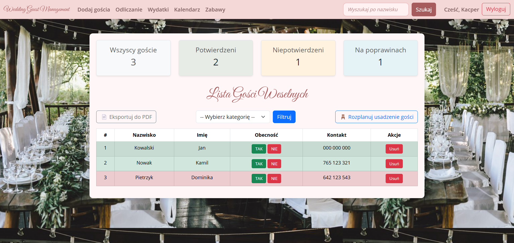
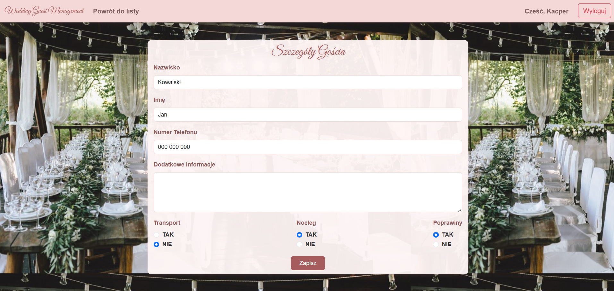
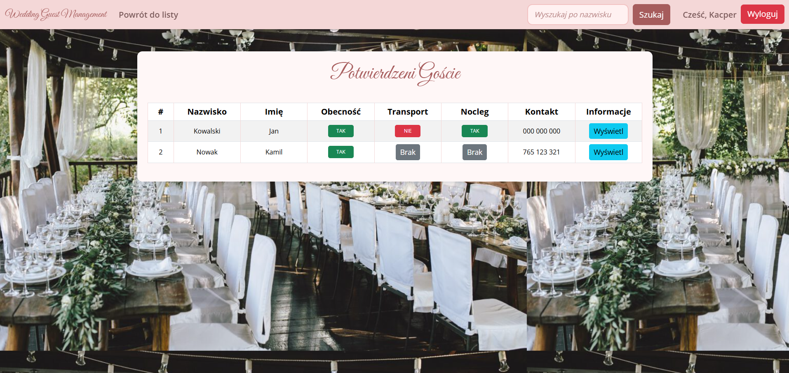
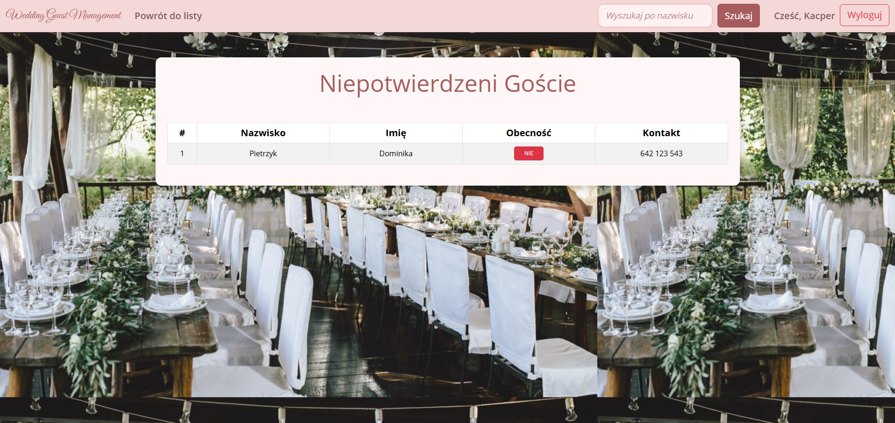
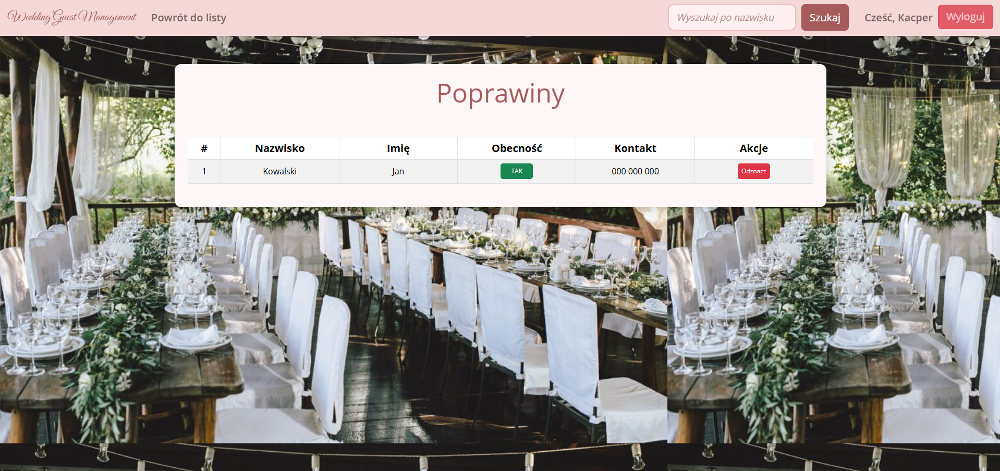
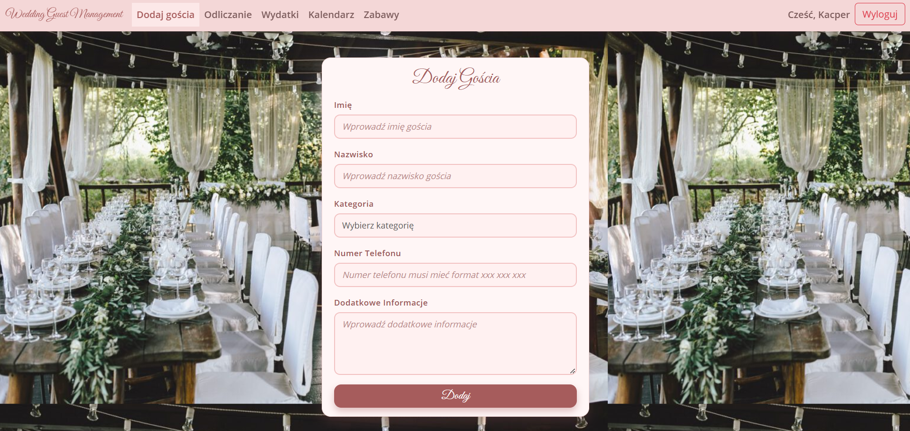

---

### 📄 PDF Exports
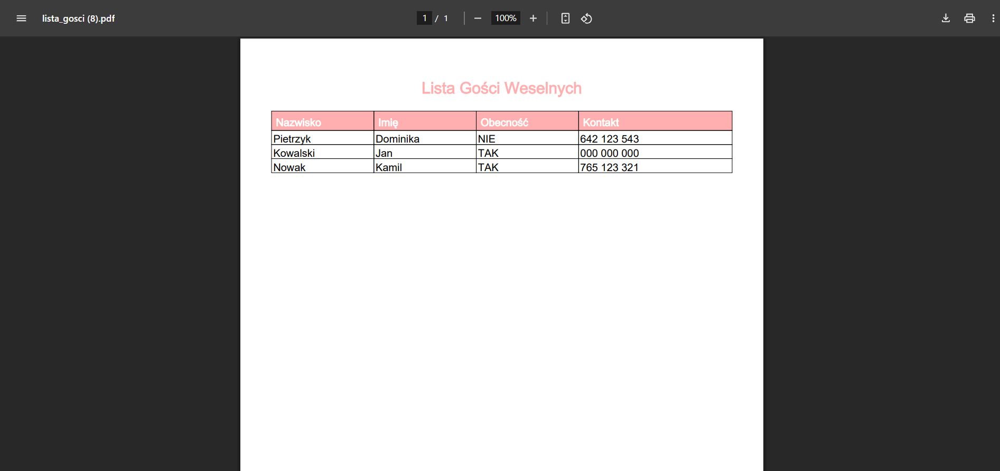
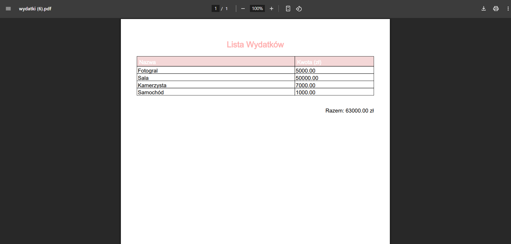
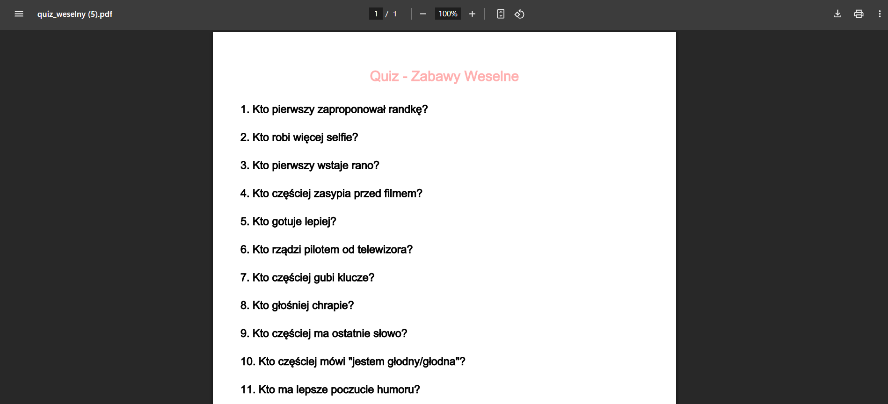

---

### 🪑 Table Planning
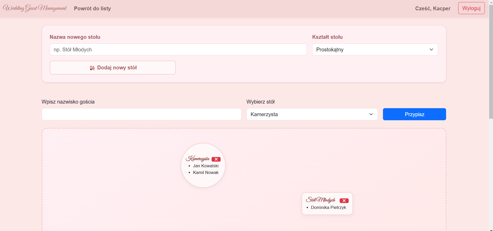

---

### 📅 Wedding Countdown & Weather
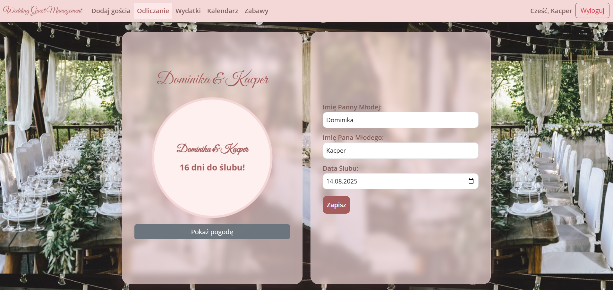
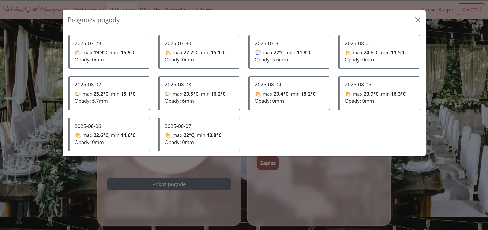

---

### 💰 Expense Tracking
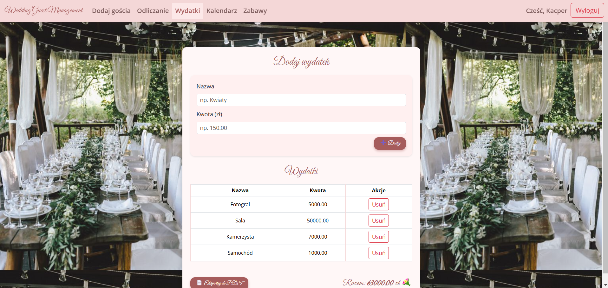

---

### 🗓️ Event Calendar
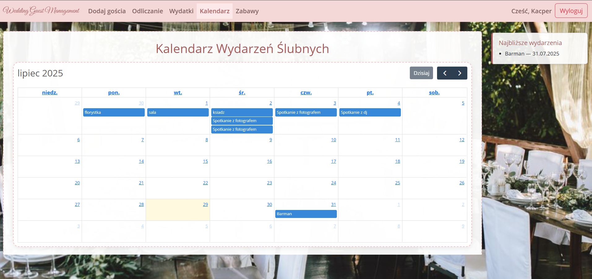

---

### 🎉 Wedding Games / Quiz
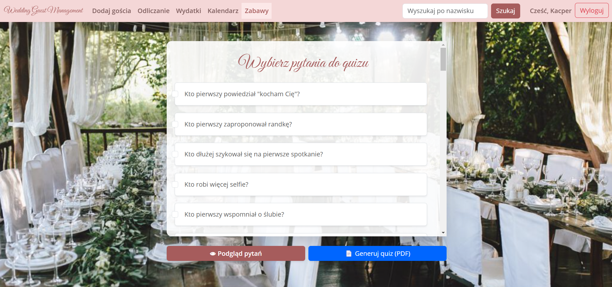

---

## 📦 Installation

1. Clone the repository  
   `https://github.com/kacper011/WeddingPlanner.git`

2. Set up MySQL database and update application properties

3. Run with Maven:  
   `mvn spring-boot:run`

4. Open in browser:  
   `http://localhost:8080`

---

## 🧑‍💻 Author

Developed by Kacper  
Feel free to contribute or open issues 💡
